### 2. Architecture Specification

This section describes the system architecture of the HealthCare.gov system including the operational views, system views, and service views. This document describes the scope of the architecture, determines the data required to support the system, conducts and analyzes the architectural impact of the system, and identifies key stakeholders.

Since the HealthCare.gov is a network-centric software system and its system architecture is complex and could not be described from a single viewpoint. The Department of Defense Architecture Framework (DoDAF) [[15]](conclusion#ref15) models are used to create the multiple viewpoints architecture for this system. By using DoDAF models, the system architecture is represented by:

- Operational Viewpoint (OV)
    - OV-1: High-Level Operational Concept Graphic
    - OV-2: Operational Resource Flow Description
    - OV-5b: Operational Activity
- System Viewpoint (SV)
    - SV-1: Systems Interface Description
    - SV-2: Systems Resource Flow Description
    - SV-4: Systems Functionality Description
- Service Viewpoint (SvcV)
    - SvcV-1: Services Context Description
    - SvcV-2: Services Resource Flow Description
    - SvcV-4: Services Functionality Description

### 2.1 OV-1: High-Level Operational Concept Graphic

The high-level operational concept view depicted in figure 1 below shows how the cloud-based healthcare marketplace will operate in the context of users, healthcare providers, government agencies, and third-party vendors.

<blockquote>
  <a name="figure1" href="../figures/figure1.png">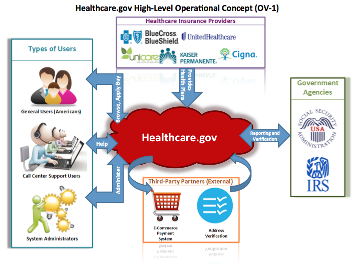</a>
  <i>Figure 1 - High-Level Operational Concept of the HealthCare.gov</i>
</blockquote>

An authorized cloud service provider who shall comply with the FedRamp requirements will host the healthcare marketplace. By leveraging the FedRamp cloud service provider, the government’s certification and accreditation requirements will be met. In addition, this will reduce capital cost for hardware and software acquisition, reduce any delays as a result of the procurement process, and maximize the return on investment.

General users will have the ability to browse, apply and purchase health plans using a web-browser. The healthcare marketplace is accessible from any geographic location using a broadband network connection. Users who do not have access to the Internet or those who need additional assistance use their local call center. The call center will browse, apply, and purchase on the users behalf. Lastly, the system administrator will have the ability to create, reset, or update the user’s login account.

Healthcare Insurance Providers will send BCP monthly insurance plans. The plans will be updated into the healthcare marketplace system and made available within the acceptable timeframe defined in the Service Level Agreement.

The healthcare marketplace will leverage third-party partners who will provide e-commerce payment services and address verification capabilities. The address verification is used to ensure that the user’s address is most current, accurate, and within the United States and its territories. The e-commerce payment service is used to process the health plan payment.

### 2.2 OV-2: Operational Resource Flow Description

The purpose of the operational resource flow as depicted in figure 2 is to illustrate how resources flow within the healthcare marketplace system.  General user enters their personal, health, and employment information as part of the application process.  This information is used to determine if the user qualifies for subsidies.  Similarly, the Call Center user can perform the same operation on behalf of the user.  In the event that the user is unable to login or create an account, the System Administrator can create, update, or reset the user’s account including their password.

During the application process, the HealthCare.gov system will invoke the address verification web service. The HealthCare.gov will send the user’s residential address and expects a result code to be returned. Also, the HealthCare.gov will verify that the user’s social security is valid by querying the database that houses the latest social security numbers. The database contains the SSN and active status that the Social Security Administration provides BPC on a monthly basis. After the user selects the healthcare plan for purchase, the credit card or bank information is sent to the e-Commerce payment provider to perform the actual transaction. If successful, the payment is debited from the user’s account and paid to the healthcare provider.

<blockquote>
  <a name="figure2" href="../figures/figure2.png" title="Figure 2 - Operational Resource Flow of the Healthcare.gov">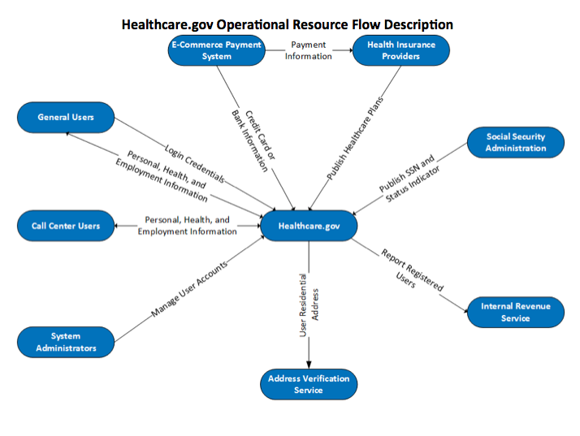</a>
  <i>Figure 2 - Operational Flow of the HealthCare.gov</i>
</blockquote>

### 2.3 OV-5b: Operational Activity Model

The Operational Activity Model in figure 3 and 4 describes operational activities and tasks of the healthcare marketplace system. The figures are grouped into four categories: Users, the HealthCare.gov system, the Cloud Service Providers, and the Data Providers. The intent is to delineate the roles and responsibility for each activity.

<blockquote>
  <a name="figure3" href="../figures/figure3.png" title="Figure 3 - Operational Activity Model for the Healthcare.gov">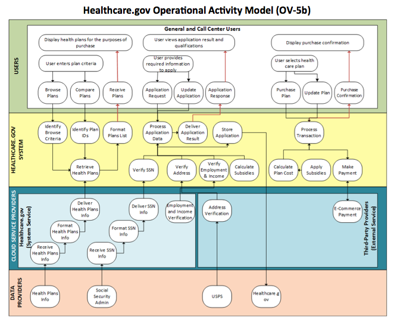</a>
  <i>Figure 3 - Operational Activity Model for the HealthCare.gov</i>
</blockquote>

The User category encompasses both General Users and Call Center Users. Call Center Users will operate the system on behalf of the user in the call centers. The diagram depicts the high-level activities of users including account creation, application login, browse and compare healthcare plans, apply for and review the status of the application results, and purchase and update the healthcare plan.

When the user wants to browse and compare healthcare plans, the request is sent to the HealthCare.gov system. The HealthCare.gov evaluates the browse criteria, retrieve the plans from the service providers based on the criteria, identify the plans, and format the results and display to the user. The cloud service provider returns the result from a data repository that has been pre-processed containing the healthcare plans and its offerings.

The application request and update invoked by the user is sent to the HealthCare.gov system.  The HealthCare.gov system perform a series of real-time verification as depicted in the figure 3 including verify the social security number to ensure that it is valid, verify the residential address for completeness and deliverability, and verify the employment and income level. The SSN verification is performed using the HealthCare.gov services, which uses the SSA data that is sent to the HealthCare.gov on a monthly basis.  The address verification services are performed in real-time using third-party providers including USPS and Experian.  The employment and income verification will be performed within the context of the healthcare.gov system. If the verification process is successful, the system will determine and calculate any applicable subsidies that the user is entitled. The result is delivered to the user and the application data is stored in the HealthCare.gov database.

<blockquote>
  <a name="figure4" href="../figures/figure4.png" title="Figure 4 - Operational Activity Model (continued) for the Healthcare.gov">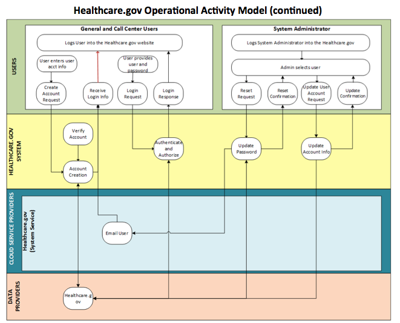</a>
  <i>Figure 4 - Operational Activity Model (continued) for the HealthCare.gov</i>
</blockquote>

After the user has selected the healthcare plan for purchase, the request is made by the user and sent to the HealthCare.gov system as illustrated in figure 3. The HealthCare.gov system processes the request including calculating the final cost, apply subsidies, and invoke a third-party cloud-service payment system to conduct the e-commerce transaction. The confirmation result along is returned to the user.

Users have the ability to create an account on the HealthCare.gov website. When the user initiates the request, the HealthCare.gov perform a verification process, stores the account information in the data store, emails the user using the cloud service, and returns the result to the user. A similar process occurs when the user logs into the HealthCare.gov system. The system authenticates and authorizes the user and logs the user into the system. For a system administrator, the HealthCare.gov allows the administrator to update the user’s password and account information as shown in figure 4. The HealthCare.gov service emails the updated password to the user while the system stores the information in a data store.

### 2.4 SV-1: Systems Interface Description

The systems design is primarily based on scalable virtual systems. We rely on two types of servers to provide web services. A static web server will be used for serving content that does not require authentication. For example, access to general information about the health care law.

All images, CSS  (Cascading Style Sheets) [[4]](conclusion#ref4) files, java script files and other files are stored on a static files server and is distributed with a content delivery system to ensure faster and more reliable content delivery.

All systems that store or serve secure information are located within a firewall and have limited access to outside world.

A web application (referred to as web app) server provides web services, web interface, mobile web interface, and security services. The load balancer redirects the incoming request to an available instance of the web application server to ensure workload is optimally distributed across the web application cluster.  

Automated services are managed by web worker which is scalable similar to the web app server. The capacity will automatically scale if the volume of tasks increases.

A queuing service communicates messages between the web app and the web worker. For example, when the user completes an application, a message is added to the queue or processing the application. The worker will read the application and process messages from the queue and run it in the background.

A Redis server is used for caching and performance improvement. Frequently used queries and data are stored with keys and values on the Redis server.

A database cluster with multiple master and slave databases is used to store the data. The master/slave setup allows us to scale the database cluster serving capacity based on the volume of traffics. In addition, it provides redundancy and failover to ensure a high-availability of the system.

Each component of this setup use TCP network transport protocol to communicate data packets. The ports, which are used for the communication, are shown on the diagram.

<blockquote>
  <a name="figure5" href="../figures/figure5.jpg" title="Figure 5">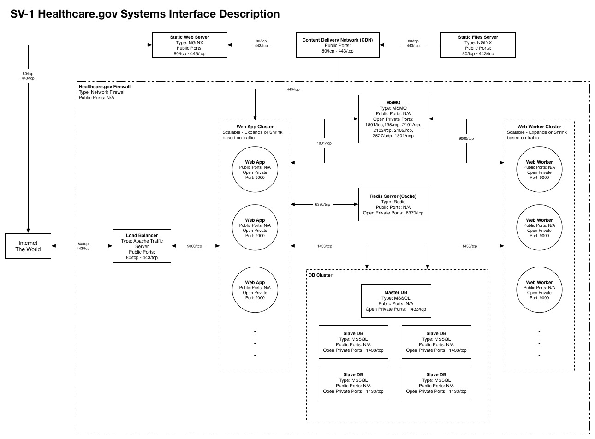</a>
  <i>Figure 5 - Systems Interface Description of HealthCare.gov</i>
</blockquote>

### 2.5 SV-2: Systems Resources Flow Description

The diagram below shows how the information flows across system resources. The diagram shows how authenticated and unauthenticated requests are directed to different web servers.

For authenticated server, a complex chain of flow is started based on the type of request.

The diagram also shows which system is responsible for accessing third party services such as Address Verification Service, etc.

<blockquote>
  <a name="figure6" href="../figures/figure6.jpg" title="Figure 6">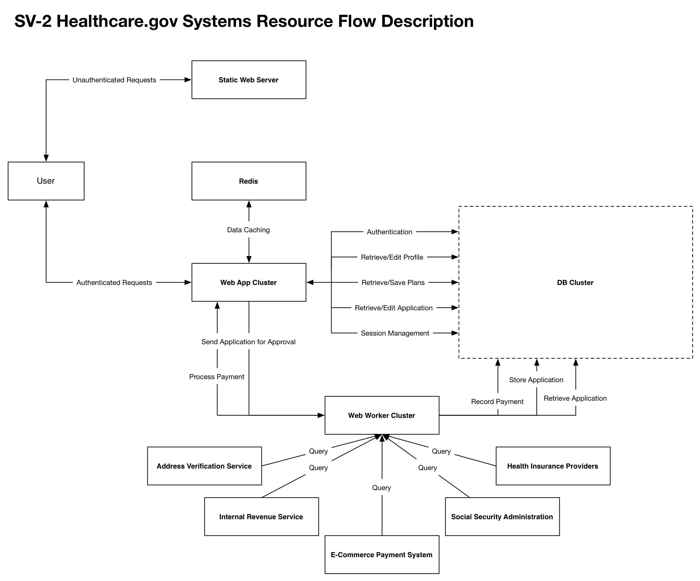</a>
  <i>Figure 6 - Systems Resource Flow Description of HealthCare.gov</i>
</blockquote>

### 2.6 SV-3: Systems Functionality  Description

This diagram shows the functions are available in each system. For example, the web app includes user registration, login, profile editing and making payments.

The diagram also shows how each function interacts with other functions. For example, the MMQ system is used for queuing messages and web worker uses the queued messages to run scheduled and automated tasks.

<blockquote>
  <a name="figure7" href="../figures/figure7.jpg" title="Figure 7">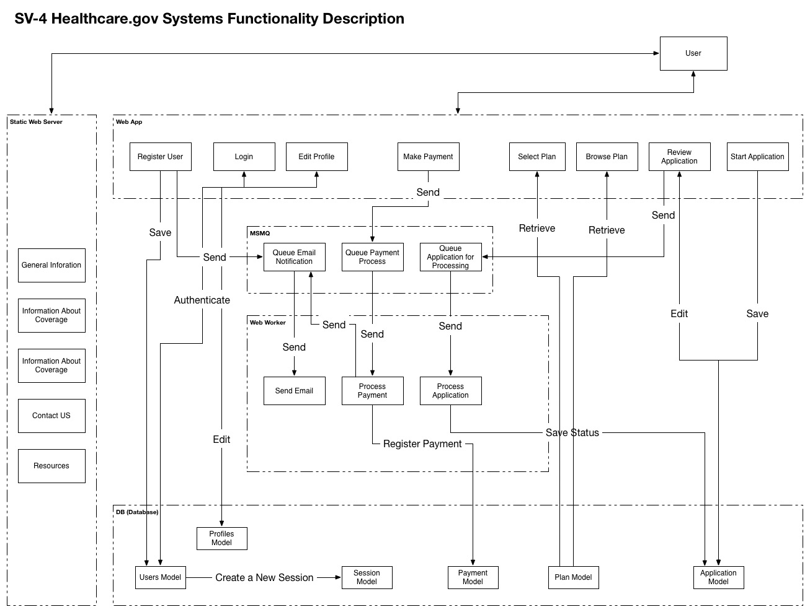</a>
  <i>Figure 7 - Systems Functionality Description of HealthCare.gov</i>
</blockquote>

### 2.7 SvcV-1: Service Context Description

In the previous section, we defined the Operational resources in OV-2. Those resources need to be supported by one or more services. In this section, we continue to architect the HealthCare.gov network-centric software system from the services viewpoints.

With the service viewpoint models, we could identify and associate the service resources to the operational and capability requirements.

#### 2.7.1 Service Concepts and Service Options

The requirement is to design a network-centric software system. For this section, by using the Service Oriented Architecture (SOA) design pattern, we are able to demonstrate how the components provide services to other components via communications protocols, the Internet network in this case.

First, by going over the conceptual layer of the service architecture, we could identify and to define the major service components. Some of the components could be outside of the scope of this ASD but need to be listed for the completed views.

The HealthCare.gov network-centric software system includes:

- **Physical nodes & Transportation:** The network of server and client computers that are connected over the Internet. As mentioned in Operational Viewpoint, the authorized and qualified cloud service providers will provide the based infrastructure for this system. In our design pattern, we will mention but do not focus on the physical infrastructure services.

- **Protocols:** In our design, this software system will use the common protocols for network and web services.

    -	Transmission Control Protocol / Internet Protocol (TCP/IP [[13]](conclusion#ref13))
    -	Internet Protocol Version 6 (IPv6 [[5]](conclusion#ref5))
    -	Simple Network Management Protocol (SNMP [[3]](conclusion#ref3))

- **Web Core Services:** Those could be considered as the software infrastructure services. The cloud service provider will provide the core services that supports for the main web application services. The web core services are defined depending on the technologies that will be used in the application. Some highlighted services are:

    -	Hypertext Markup Language (HTML [[2]](conclusion#ref2)) is the standard markup language used to create web pages.
    -	Hypertext Transfer Protocol (HTTP [[1]](conclusion#ref1)) is “an application-level protocol for distributed, collaborative, hypermedia information systems. HTTP is the foundation of data communication for the World Wide Web (WWW).”
    -	HTTP over Transport Layer Security (TLS [[6]](conclusion#ref6)), referred to as HTTPS [[12]](conclusion#ref12), is the communication protocol for secure communication over a computer network.
    -	Simple Object Access Protocol (SOAP [[14]](conclusion#ref14)) is “an XML-based [[7]](conclusion#ref7) messaging protocol used to encode the information in web service request and response messages before sending them over a network.”
    -	Web Services Description Language (WSDL [[17]](conclusion#ref17)) is “an XML-formatted language used to describe a Web service's capabilities”.
    -	Extensible Markup Language (XML [[7]](conclusion#ref7)) is a standard that used to describe the data. It is very common used in web application.

- **Enterprise Service Bus (ESB [[8]](conclusion#ref8)):** An article from Oracle provides a definition for ESB as “A style of integration architecture that allows communication via a common communication bus that consists of a variety of point-to-point connections between providers and users of services.”

    With ESB, the services of the system are divided into the service providers and the service consumers. That means the services provide and consume the service resource of each other.

    In this ESB software architecture model, there are system services that control the internal system activities flows. In this ASD, the ESB layer is a conceptual layer. The ESB keeps an essential role to handle the Web Application Services, the Web Core Services, and the infrastructure services. The ESB is used to monitor and control the routing of the services communications and transformations. The Universal Description, Discovery and Integration (UDDI [[16]](conclusion#ref16)) is a web-based distributed directory that enables listing of web services and discovering each other.

-	**Orchestration (Automation):** The services that are automated and provide supports for other services of the system.

- **Services Presentation and Management:** The security layer to manage the accessibility to the web application services.

Figure 8 shows the layered architecture of NationalHealthCare.gov

<blockquote>
  <a name="figure8" href="../figures/figure8.png" title="Figure 8">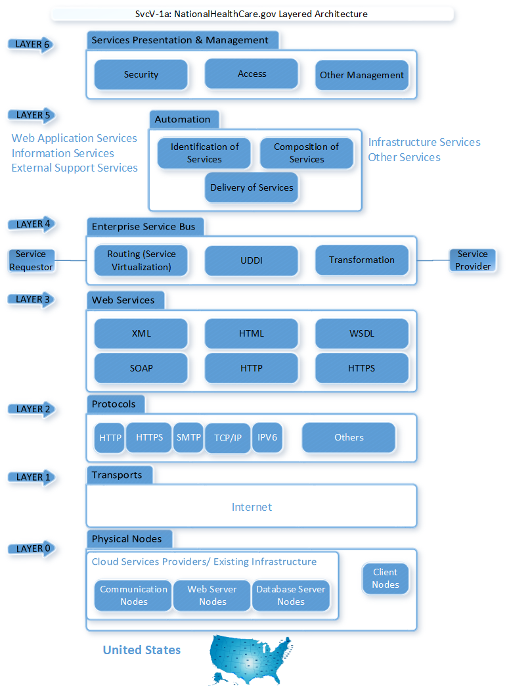</a>
  <i>Figure 8 - Conceptual Layered Architecture of the HealthCare.gov</i>
</blockquote>

#### 2.7.2 Service Integration Planning and Management

Expanding from the conceptual layers viewpoint, the system is made up from multiple service components. There are basic groups of services and the flow of interaction between those groups of services. The services flows are not limited to internal system and application services. The service groups also include the services related to the human interactions and managements.

Below, figure 9, is the SOA overview of the HealthCare.gov. This diagram shows the basic integration of the service components in the system.

The network-centric software system consists of the basic service components as seen above in the conceptual layers. ESB is the central component, which controls and interacts with the system services: Database Services, Security Services, Automation Services, UDDI Registry, Web Core Services, and Web Service Interfaces. Over common protocols, the backend web application and the third-party services (external services from the providers) could access and use the central system resource. Similarly, over the same protocols, the administrator could access and use the web system administration services. The front-end users include the Call Center users and the generic users. Those users could access the web interface using different devices and over the same protocols. The Call Center users also manage the assistant services to assist the generic users.

<blockquote>
  <a name="figure9" href="../figures/figure9.png" title="Figure 9">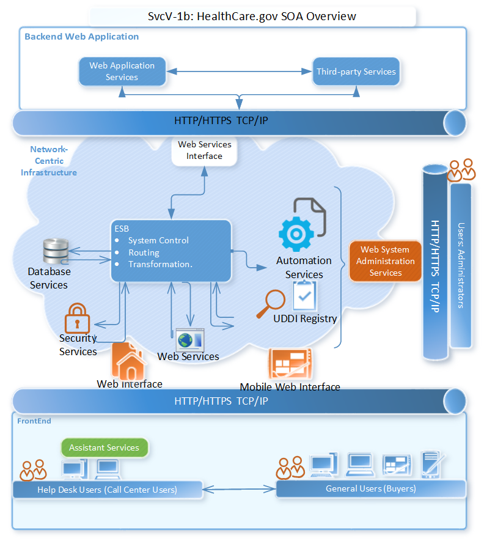</a>
  <i>Figure 9 - SOA Overview of the HealthCare.gov</i>
</blockquote>

#### 2.7.3 Services Context Description

In addition to the basic layers and the integration of basic service components, the detail service context plays an important role in SOA design pattern. It describes the services layout that required for the operations of the system.

According to the requirement specifications and the Operational View, we have the following services and service components (figure 10).

<blockquote>
  <a name="figure10" href="../figures/figure10.png" title="Figure 10">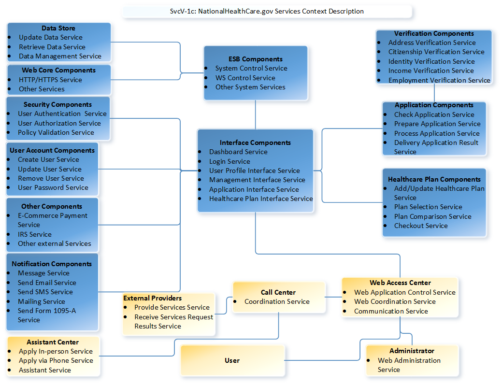</a>
  <i>Figure 10 - Services Context Description of the HealthCare.gov</i>
</blockquote>

### 2.8 SvcV-2: Service Resource Flow Description

By expanding the Service Context Description, we have the services and service flows that described in Figure 11.

The ESB services provide the core services to coordinate request and processes that occur in the backend of the system. It would process the service request and service response for accessing or updating the data services and the web core services.

The Interface services contain the interface of the major component of this system such as: Dashboard, Login, User Profile, Application, and Healthcare Plan. Each interface service would interact with multiple functional components. The Interface services could be considered as the action controller of the system: all the functional services are being called from the uses of interface services. During processing the service request, the interface services could send and receive the service requests for accessing or updating the data services and the web core services.

There are the service components to support the interface services and the service components to support the system.

The User Account services would be used to support the User Profile Interface service and some other related services. The User Account services receive the requests related to user managements and send the approximate reply.

The Security services keep a major role in the system. The Security services could interact directly with the Login service. And the Security services could interact indirectly with every other services of the system.

The Application services are being used for handling the application process and interact directly with the Application Interface service.

The Verification services support for the Application services. The Verification services receive the service requests from the Application services, process the request, and reply to the requests.

The Healthcare Plan services work for the Healthcare Plan Interface service. Once receiving the requests for plan purchase, the Healthcare Plan services process and reply with the results.

The Notification services are being used to support for the whole web application and send the approximate notifications per request.

There is also the External Support services, which are the services provided by external service providers.

While accessing the system, each type of user would have different type of service requests.
The Web Access Center would coordinate the service request from the users and send the request to the interface components. The interface components would process and decide the service to handle the request from the Web Access Center. After processing, the interface components would send the replies to the Web Access Center; the Web Access Center would process and send the replies to the user’s requests.

The more detail flows and descriptions could be seen in figure 11 below:

<blockquote>
  <a name="figure11" href="../figures/figure11.png" title="Figure 11">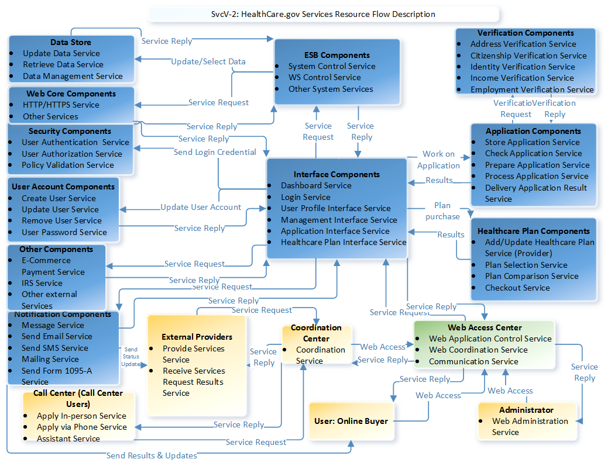</a>
  <i>Figure 11 - Services Resource Flow Description of the HealthCare.gov</i>
</blockquote>

### 2.9 SvcV-4: Service Functionality Description

Service Functionality Description describes the functions performed by services and the service data flows among service functions.

This section identifies and describes the allocation of service functions to resources and the flow of resources between service functions.

The overview and the integrations of service functionalities are described in Figure 12 and the detail functionality description is described in Figure 13.

In general, the system consists of Web-based Application service, web core services, ESB services, External Support services, Infrastructure services, and the External Consumer services (Human Interaction services).

As mentioned previously, ESB and Web Core Services provide the core software base for the system.

The Web-based Application services have the following basic functionalities: Operations, Account Management, Application, and Plan Purchase.

The External Support services are the group of system services that linked to the service providers. These services provide the support functionalities to the core web application.

The Infrastructure services, which are provided by cloud service provider and are not in the scope of the current design architecture, provide the base for the whole system.

The External Consumers services maintain the functionality to support and to work with each type of users.

<blockquote>
  <a name="figure12" href="../figures/figure12.png" title="Figure 12">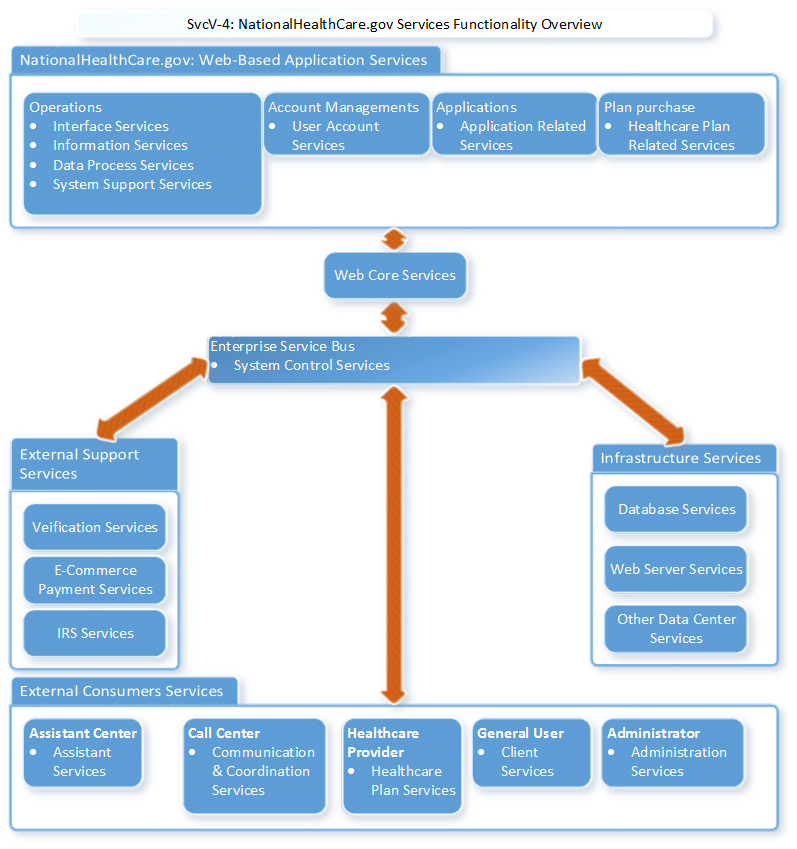</a>
  <i>Figure 12 - Services Functionality Overview of the HealthCare.gov</i>
</blockquote>

In detail, the HealthCare.gov network-centric web-based system contains of the following core sets of service functionality:

- Front-end Web Services.
- Core Services.
  - ESB Services
  - Web Core Services
- Web-based Application Services.
  - Core function Services
    - User Management Services
    - Application Services
    - System Support Services
      - Data Processes & Functions Services
  - Interface Services
    - User Management Interface Services
    - User Dashboard Services
    - Application Interface Services
    - Healthcare Plan Interface Services
  - Information Services
    - Security Services
    - Notification Services
  - External Support Services.
- Infrastructure Services (provided by external services providers – cloud services providers).
  - Data Center Services
  - Networking Services
    - Communication Connectivity Services

<blockquote>
  <a name="figure13" href="../figures/figure13.png" title="Figure 13">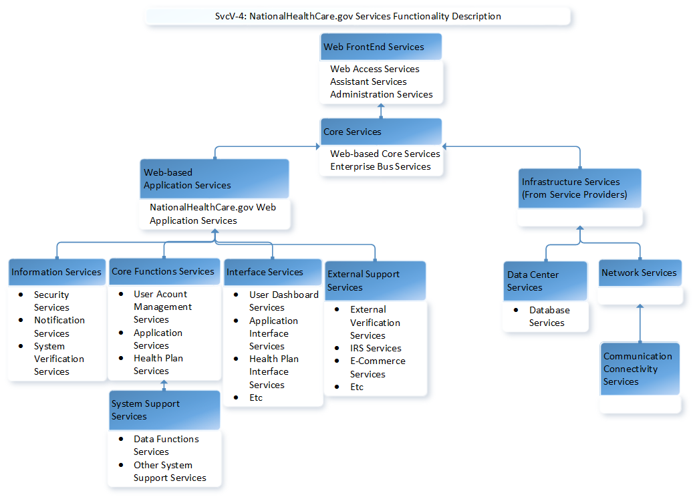</a>
  <i>Figure 13 - Services Functionality Description of the HealthCare.gov</i>
</blockquote>
